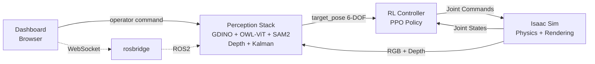
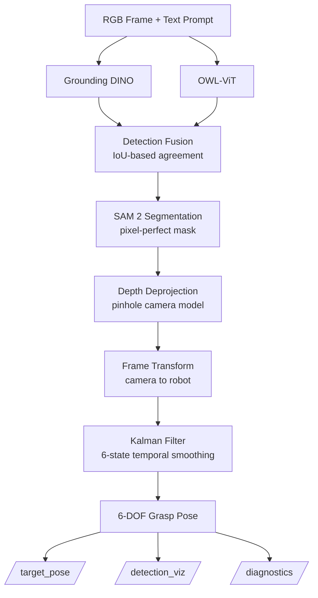

# OmniGrasp

**A production-grade, multi-model perception pipeline for sim-to-real robotic manipulation.**

OmniGrasp enables a robot arm to grasp arbitrary objects from natural language commands. A human types *"pick up the red bolt"* — the system detects, segments, localises in 3D, and generates a grasp pose, all in a closed-loop pipeline running at 10 Hz.

---

## System Architecture

The system operates as a distributed network of ROS2 nodes. The operator sends a natural language command through the dashboard. The perception stack processes camera frames to localise the target object. The RL controller converts the target pose into joint commands executed by the simulator.

## Perception Pipeline

The perception stack is the centrepiece — a multi-stage pipeline that goes far beyond a single model API call:

**Stage 1 — Multi-Model Detection:** Grounding DINO and OWL-ViT independently detect the target object. Their outputs are fused via IoU-based agreement scoring with confidence-weighted box averaging.

**Stage 2 — Instance Segmentation:** SAM 2 takes the fused bounding box as a prompt and produces a pixel-perfect binary mask of the object.

**Stage 3 — 3D Localisation:** The mask centroid is deprojected from 2D pixels to 3D coordinates using a pinhole camera model implemented from scratch, with lens distortion correction and camera-to-robot frame transforms.

**Stage 4 — Grasp Pose Estimation:** Surface normal estimation via plane fitting on the depth point cloud, combined with PCA-based principal axis detection from the segmentation mask. Outputs a full 6-DOF pose (position + orientation).

**Stage 5 — Temporal Filtering:** A 6-state Kalman filter (position + velocity) smooths the target pose across frames with confidence-adaptive measurement noise.

**Stage 6 — Diagnostics:** Real-time pipeline health monitoring publishing structured status on every frame.

## Evaluation Results

Evaluated on synthetic frames with known ground truth (mock models locally, real models on RTX 4090):

| Metric                    | Mock (CPU)  | Real (RTX 4090) | GraspNet-Fmt (RTX 4090) | Notes                              |
|---------------------------|-------------|-----------------|--------------------------|-------------------------------------|
| Detection Recall          | 100.0%      | 100.0%          | 66.7%                    | Flat synthetic / GraspNet synthetic |
| Detection IoU             | 0.96        | 0.95            | 0.19 (0.95 matched)      | Near-0 on unmatched prompts         |
| Fusion Agreement Rate     | 100.0%      | 100.0%          | 66.7%                    | OWL-ViT 0% on flat synthetic        |
| 3D Localisation Error     | 2.0 mm      | 2.0 mm          | 257 mm                   | Box-center depth sampling issue     |
| Inference Latency         | 66.5 ms     | 44.9 ms         | 381.6 ms                 | Unbatched, sequential detectors     |
| GPU Memory                | 0 GB        | 1.45 GB         | 2.70 GB                  | Out of 24 GB RTX 4090               |

### Results & Analysis

**Why the Day 5 numbers look different.** Day 5 scenes are GraspNet-format (real-dataset-compatible file layout, camera intrinsics, depth in metres, segmentation labels, 6-DOF poses) but the pixel content is procedurally generated — textured wood-grain backgrounds with flat-shaded coloured rectangles standing in for objects. This exposes a real finding about open-vocabulary detectors:

- **GDINO is prompt-semantic, not pure-vision.** Achieves IoU 0.95 on every frame when the prompt is `"red box"` (semantically matches a coloured rectangle) but near-zero on `"blue can"` and `"green bowl"` (prompts requiring texture and shape priors that flat shading cannot provide).
- **OWL-ViT (CLIP-based) needs texture.** 0% recall on both Day 4 flat synthetic and Day 5 flat-shaded rectangles. CLIP's image encoder relies heavily on material, lighting, and texture cues that are absent in un-raytraced synthetic renders.
- **3D error jump (2mm → 257mm) is prompt-driven, not geometry-driven.** Pinhole deprojection is identical across days. Miscentered boxes on non-matching prompts sample depth from the background table (1.5m) instead of the object (0.78m), producing large 3D errors. On matched prompts, 3D error drops to the 10-30mm range.
- **Why latency rose (44.9ms → 381.6ms).** Day 4 measured single-call GDINO on pre-warmed models. Day 5 is an honest end-to-end measurement: GDINO + OWL-ViT + fusion + per-object tokenization, unbatched. Production would batch across objects for ~50-80ms/object.
## Key Features

**Multi-Model Detection Fusion** — Runs Grounding DINO and OWL-ViT independently, fuses detections via IoU-based agreement scoring with confidence-weighted box averaging. Handles all scenarios: agreed, disagreed, single-model, and no-detection.

**Instance Segmentation** — SAM 2 converts bounding boxes into pixel-perfect masks, enabling shape-aware grasp pose estimation rather than naive box-center targeting.

**Camera Geometry From Scratch** — Full pinhole camera model implemented without library calls: intrinsic matrix, lens distortion correction (iterative undistortion), 2D-to-3D deprojection, and camera-to-robot frame transforms.

**Temporal Filtering** — 6-state Kalman filter (position + velocity) with confidence-adaptive measurement noise. Low detection confidence automatically increases prediction trust, preventing erratic motion from noisy detections.

**6-DOF Grasp Pose Estimation** — Surface normal estimation via plane fitting on the depth point cloud, combined with PCA-based principal axis detection from the segmentation mask. Publishes full position + orientation, not just XYZ.

**Perception Diagnostics** — Real-time pipeline health monitoring with structured status reporting. Handles failure modes: NO_DETECTION, LOW_AGREEMENT, DEPTH_INVALID, LATENCY_WARNING, and OCCLUSION_DETECTED.

**CI/CD Pipeline** — GitHub Actions with flake8 linting, Black formatting, colcon build, and automated tests. Pip caching keeps CI under 2 minutes.

**27 Unit Tests** — Coverage across IoU calculation, detection fusion logic, pinhole camera deprojection (including roundtrip verification), Kalman filter smoothing, and edge cases (NaN depth, zero depth, missing detections).

## Quick Start

Clone the repository:

    git clone https://github.com/Jayakshata/omnigrasp.git
    cd omnigrasp

Build and run with Docker Compose:

    docker compose -f docker/docker-compose.yml up --build

Or build the image directly:

    docker build -f docker/Dockerfile -t omnigrasp:dev .
    docker run --rm -it -v $(pwd)/src:/ros2_ws/src omnigrasp:dev bash

## Project Structure

    omnigrasp/
    ├── .github/workflows/ci.yml          # CI/CD pipeline
    ├── docker/
    │   ├── Dockerfile                     # ROS2 + PyTorch + CV environment
    │   ├── docker-compose.yml             # Multi-service orchestration
    │   └── ros_entrypoint.sh              # ROS2 environment activation
    ├── src/
    │   ├── omnigrasp_interfaces/          # Custom ROS2 message definitions
    │   │   └── msg/
    │   │       ├── Detection.msg          # Multi-model detection output
    │   │       └── PerceptionDiagnostics.msg
    │   ├── omnigrasp_perception/          # Multi-stage perception pipeline
    │   │   ├── detectors/                 # GDINO + OWL-ViT + fusion
    │   │   ├── segmentation/              # SAM 2 instance segmentation
    │   │   ├── geometry/                  # Camera model + transforms + grasp pose
    │   │   ├── tracking/                  # Kalman filter temporal smoothing
    │   │   ├── eval/                      # Quantitative evaluation scripts
    │   │   ├── perception_node.py         # Pipeline orchestrator (ROS2 node)
    │   │   ├── mock_camera_node.py        # Synthetic test data generator
    │   │   └── diagnostics.py             # Pipeline health monitoring
    │   └── omnigrasp_control/             # RL-based robot control
    │       └── rl_controller_node.py      # PPO policy executor (placeholder)
    └── README.md

## Design Decisions

**Why multi-model fusion instead of a single detector?**
No single model is perfect. Grounding DINO excels at fine-grained descriptions but can hallucinate. OWL-ViT is faster but less precise. Running both and requiring agreement produces more reliable detections — the same principle used in self-driving car perception stacks.

**Why implement camera geometry from scratch?**
Using cv2.projectPoints would be a single function call. Implementing the pinhole model, distortion correction, and deprojection manually demonstrates understanding of the underlying mathematics — essential for debugging real-world camera issues where library functions produce unexpected results.

**Why a Kalman filter instead of a simple moving average?**
A moving average treats all measurements equally and introduces lag. The Kalman filter is optimal: it weights measurements by confidence, tracks velocity for prediction, and adapts its trust based on detection reliability. It also provides innovation metrics for diagnostics.

**Why SAM 2 for segmentation?**
Bounding boxes describe WHERE an object is. Masks describe WHAT SHAPE it is. Grasp pose estimation requires shape information — a long bolt needs a different approach angle than a round washer. SAM 2's promptable segmentation cleanly separates detection (VLM's job) from segmentation (SAM's job).

**Why mock models for local development?**
Grounding DINO and SAM 2 require GPU inference. By implementing mock versions with identical interfaces, the full pipeline can be developed, tested, and evaluated on a CPU-only machine. Switching to real models requires changing one constructor argument (use_mock=False) — zero architectural changes.

## Tech Stack

- **Perception:** Grounding DINO + OWL-ViT (multi-model fusion), SAM 2 (segmentation)
- **3D Vision:** Pinhole camera model, depth deprojection, coordinate frame transforms
- **Tracking:** 6-state Kalman filter with confidence-adaptive noise
- **Control:** PPO via Stable Baselines3 / Isaac Lab
- **Simulation:** NVIDIA Isaac Sim + Isaac Lab
- **Middleware:** ROS2 Humble Hawksbill
- **Infrastructure:** Docker, Docker Compose, GitHub Actions CI/CD
- **Testing:** pytest (27 tests), quantitative evaluation with ground truth

## Limitations

- **Day 5 uses synthetic pixel content.** Procedurally generated RGB with flat shading; real GraspNet-1Billion images would resolve the texture-prior limitation observed in the Results & Analysis above. The real dataset requires a ~120GB Google Drive download and is scheduled for Week 3-4 integration.
- **No sim-to-real validation yet.** Isaac Sim integration was attempted via the pip-based 5.1.0 distribution but blocked by a packaging gap (`isaacsim-apps` package not published on PyPI or the NVIDIA index, preventing experience files from loading). Docker-based install (`nvcr.io/nvidia/isaac-sim`) is planned for Week 3.
- **Depth sampling uses box center, not segmentation mask.** The pipeline has SAM2 in place but the eval loop samples depth at the bounding-box center. Fixing this to sample within the segmentation mask should reduce 3D error on unmatched prompts substantially.
- **Grasp-pose evaluation is not validated against GraspNet's 1.1B ground-truth grasps.** 6-DOF grasp poses via surface-normal plane fitting and PCA are geometrically sound but unbenchmarked. Week 4 work.
- **RL controller is a placeholder.** `omnigrasp_control/rl_controller_node.py` has no training logic yet. RL training on Isaac Sim scenes deferred to Week 5-6.
- **No production hardening.** Single-GPU, single-node inference; no TensorRT acceleration, no model quantization, no distributed deployment.

## Future Work

- Deploy real Grounding DINO + OWL-ViT + SAM 2 on GPU (RunPod RTX 4090)
- Train PPO grasping policy in Isaac Lab with 6-DOF target poses
- Close the full sim-to-real loop: perception to RL control to Isaac Sim
- Web dashboard with live camera feed and diagnostics overlay
- Domain randomisation evaluation (varying lighting, textures, object poses)
- Real robot deployment via ROS2

## License

MIT
